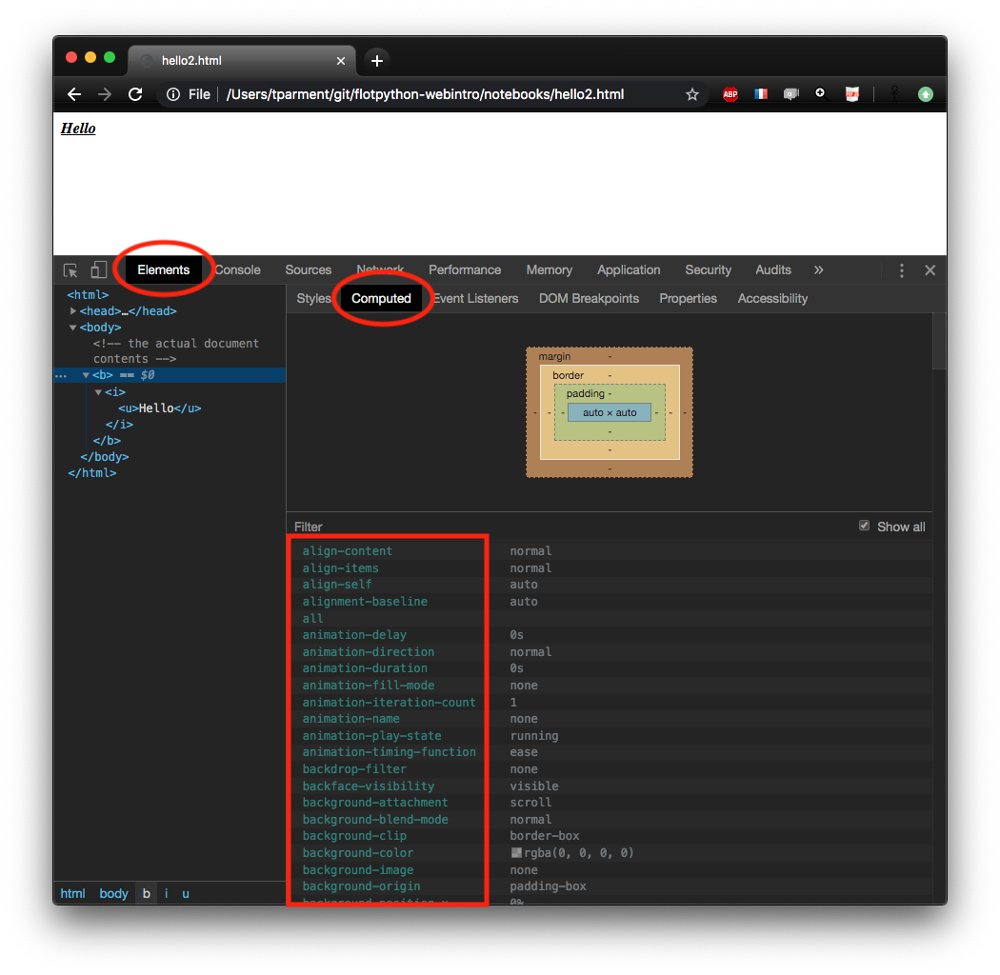

Licence CC BY-NC-ND, Thierry Parmentelat

+++ {"slideshow": {"slide_type": ""}}

# CSS basics

```{code-cell}
tools = require('../js/tools'); tools.init()
```

+++ {"slideshow": {"slide_type": "slide"}}

## purpose of style sheet

+++ {"slideshow": {"slide_type": ""}}

* keep contents and presentation separate
* allow to adapt same contents 
  * to different media
  * to differents tastes (themes)
* generally written by people with  
  different background and sensibility

  * engineers *vs* designers

+++ {"slideshow": {"slide_type": "slide"}}

## what can be styled ?

+++ {"slideshow": {"slide_type": ""}}

* short answer : virtually everything
* let's start with the obvious

+++ {"slideshow": {"slide_type": "slide"}}

## text properties

+++ {"slideshow": {"slide_type": ""}}

* `font-family` : e.g. Times
* `font-size` : e.g. 12px
* `font-weight` : e.g. bold
* `font-style` : e.g. italic
* `text-decoration` : e.g. underline
* … and a whole many more

+++ {"cell_style": "center", "slideshow": {"slide_type": "slide"}}



+++ {"cell_style": "center", "slideshow": {"slide_type": "slide"}}


+++ {"slideshow": {"slide_type": "slide"}}

## first example

+++

* we create a hyperlink to google
* we attach a CSS fragment to change its appearance
* **warning** this changes **all the `<a>` elements** on that page

+++

<p class="note">

here we use `target='_'`
to tell the browser to open the link in another tab/window  
this is a detail, and for convenience only, so that unintentionally clicking on the link will keep you on this page

</p>

```{code-cell}
---
hide_input: true
slideshow:
  slide_type: slide
tags: [hide_input]
---
link_html = `<a href="https://www.google.com" target="_">
link to google
</a>
`
link_css = `/* change these properties
   on all <a> elements in the page */
a {
    color: red;
    font-family: times;
    font-size: large;
    padding: 10px;
    border: 1px solid green;
    border-radius: 8px;
    text-decoration: none;
}`
tools.sample_from_strings({html: link_html, css: link_css}, {width: '40em'})
```

+++ {"slideshow": {"slide_type": "slide"}}

## vocabulary

+++

* the names that appear  
  on the left hand side of the `:` colon   
  like `color`, `font-family`, …

* are called **properties** 
* also listed in the `Elements` tab of the devel tools,  
  in the `Computed` pane

* [several hundreds of them](https://css-tricks.com/how-many-css-properties-are-there/)
* note that not all properties are relevant on all elements
