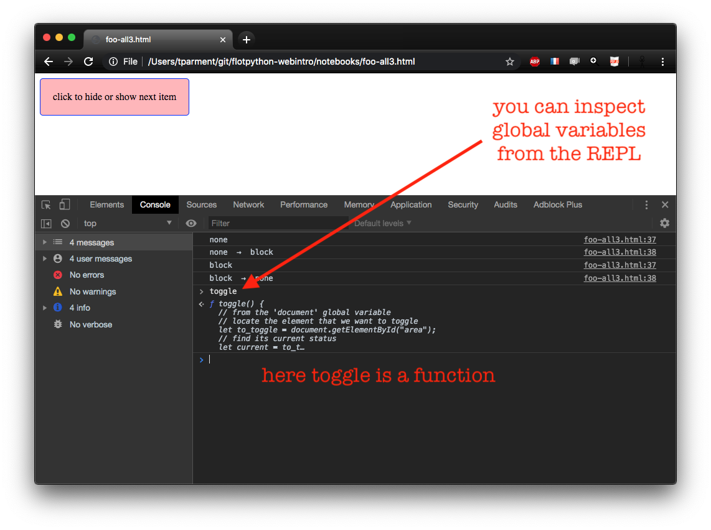

+++ {"slideshow": {"slide_type": "slide"}}

Licence CC BY-NC-ND, Thierry Parmentelat

+++ {"slideshow": {"slide_type": ""}}

# practice : blinking background

```{code-cell}
tools = require('../js/tools'); tools.init()
```

+++ {"slideshow": {"slide_type": ""}}

in this notebook :

* a simple assignment
* plus a few tips to get started
* **make sure you read this notebook thoroughly before you start**

+++ {"slideshow": {"slide_type": "slide"}}

## assignment

* create a HTML document as a collection of 3 files, 
* say : `resume.html`, `resume.css`, `resume.js`
* make sure the html `<head>` loads **both** the css and js companions

+++

then 

* edit the JavaScript code
* so that your resume background alternates  
  every 1 second between 2 different colours

+++ {"slideshow": {"slide_type": "slide"}}

something like this

```{code-cell}
---
hide_input: true
slideshow:
  slide_type: ''
tags: [hide_input]
---
tools.sample_from_stem("../samples/41-resume-blinking", {sources_show: false})
```

+++ {"slideshow": {"slide_type": "slide"}}

## tip #1 : run code upon load

+++ {"slideshow": {"slide_type": ""}}

so, you want to start some code, say call function `start()`   
right **after the page loads**  
**BUT** it is **unsafe** to do something like 

```html
<!-- DO NOT DO THIS -->

<script src="thecode.js"></script>
<script>
start('some-data')
</script>
```

because at the time when `start('some-data')` gets executed,  
your page is still in the middle of the loading phase  
(you might be lucky and this may work just fine for you  
 but then it is *a coincidence* and that is **not right**)

+++ {"slideshow": {"slide_type": "slide"}}

### run code upon load : the proper way

+++

the proper way is to attach a **callback** to the page **`load`** event

```javascript
// attach an (anonymous) function to the 'load' event
window.addEventListener(
    'load', function() { start('some-data'))

// OR, same but a little nicer, with an arrow function
window.addEventListener(
    'load', () => start('some-data'))
```

this time, `start()` will get **called later**  
at a time where you can be sure the document is entirely **loaded**

+++ {"slideshow": {"slide_type": "slide"}}

## tip #2: implement a cyclic task

+++

implementing a cyclic task was done in example 2 already as a reminder: based on `setInterval()`. You may use clearInterval to cancel.

```{code-cell}
:cell_style: split

// so that we can stop the running loop
active = true;

function one_step() {
    if (active)
        console.log("beep");
}

// make sure you use 'let' 
// and not 'var' in your code
var interval = setInterval(one_step, 1000)
```

```{code-cell}
:cell_style: split

// note that our JS interpreter 
// is still responsive
// we can stop the endless loop
active = false
```

```{code-cell}
:cell_style: split

// it's also possible to stop it
// altogether
active = true
clearInterval(interval)
```

+++ {"slideshow": {"slide_type": "slide"}}

### observations on cyclic tasks

+++

in a Python language one would maybe consider writing something like

+++ {"cell_style": "split"}

```python
while True:
    if active:
        one_step()
    sleep 1
```

+++ {"cell_style": "split"}

_Note:_ however with such an approach, the Python interpreter **can't do anything else** at the same time

+++ {"slideshow": {"slide_type": "slide"}}

## tip #3 : use devel tools

+++

* crucially important to get familiar with these tools  
*  starting with the most useful ones :
  * *Elements*
  * *Console*
  * and to a lesser extent, *Sources*

+++ {"slideshow": {"slide_type": "slide"}}

### Devel Tools : *Elements*

+++

as mentioned earlier already, you can

* navigate the DOM
* '*Inspect* ' an element (find an element from a position in the page)
* see the CSS rules that apply to an element 
* find out where these styles come from
* see the computed values for each property
* interactively change a property and  
  see effect immediately (shown on next slide)

+++ {"slideshow": {"slide_type": "slide"}}

### visualizing a changed property

+++


+++ {"slideshow": {"slide_type": "slide"}}

### Devel Tools : the *Console* REPL

+++

* the place where lands the output of `console.log`  
  of course quite useful for naive debugging

* **and** that lets you **run JavaScript** on the fly  
  much like the Python interpreter does  

* known as a REPL ( = Read Eval Print Loop)
* illustrated in the following slides

+++

* REPL stands for Read, Eval, Print Loop

+++ {"slideshow": {"slide_type": "slide"}}


+++ {"slideshow": {"slide_type": "slide"}}



+++ {"slideshow": {"slide_type": "slide"}}


+++ {"slideshow": {"slide_type": "slide"}}


+++ {"slideshow": {"slide_type": "slide"}}

### Devel Tools : *Sources*

+++ {"cell_style": "split"}

* occasionnally useful to browse the code actually loaded

+++ {"cell_style": "split"}


+++ {"slideshow": {"slide_type": "slide"}}

### Devel Tools : debugger

+++ {"cell_style": "split"}

* the *Sources* tab has buit-in debugging features

+++ {"cell_style": "split"}


+++ {"slideshow": {"slide_type": "slide"}}

### more on devel tools

+++ {"slideshow": {"slide_type": ""}}

* there are standard keyboard shortcuts to invoke devel tools,  
* e.g. for [google chrome](https://developers.google.com/web/tools/chrome-devtools/shortcuts)  
  * macOS `⌘ ⌥ J` (console) or `⌘ ⌥ I` (your last tab)
  * others `⌃ ⇧ J` (console) or `⌃ ⇧ I` (your last tab)
  * others `ctrl+shift+J` (console) or `ctrl+shift+I` (your last tab)
* a bit early for now, but be aware that  
  they come with a complete debugger

* do not hesitate to search for some hands-on / video tuto

+++ {"slideshow": {"slide_type": "slide"}}

## tip #4: the browser cache (yet again)

+++

* the browser cache thingy (see CSS loading)
* applies exactly the same  
* in the case of JavaScript code

**Remember**

* to use Shift-reload, or other cache-cleaning tool  
* if changes in a file do not seem to kick in
